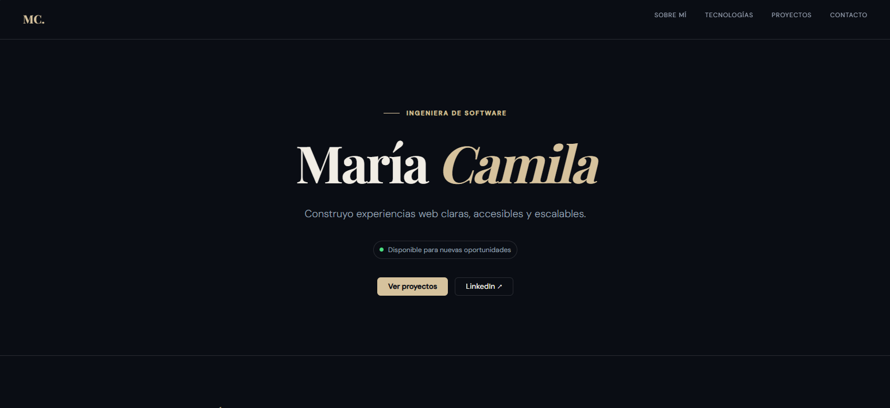

# Portfolio profesional — María Camila

Portfolio personal desarrollado con **Python** y **Reflex**. Presenta perfil profesional, tecnologías, proyectos y formas de contacto en una interfaz responsive y accesible.

## Vista previa



## Tecnologías

- Python 3.11+
- Reflex 0.9.0
- CSS responsivo mediante propiedades de Reflex

## Ejecutar localmente

```powershell
python -m venv .venv
.\.venv\Scripts\Activate.ps1
pip install -r requirements.txt
reflex run
```

## Personalización antes de publicar

1. Edita `WebPython/data.py` con tu correo, GitHub, LinkedIn, biografía y proyectos reales.
2. Reemplaza el proyecto de ejemplo por 2–4 proyectos con problema, solución, tecnologías y resultado.
3. Añade una captura en `assets/preview.png`.
4. Configura la URL de despliegue y actualiza los enlaces de demo de cada proyecto.

## Estructura

```text
WebPython/
├── WebPython/
│   ├── components/     # Secciones y primitivas visuales reutilizables
│   ├── data.py         # Contenido personal, enlaces y proyectos
│   └── WebPython.py    # Aplicación y metadatos SEO
├── assets/             # Recursos estáticos
└── requirements.txt
```

## Licencia

Puedes añadir una licencia MIT si quieres permitir que otros reutilicen el código con atribución.
